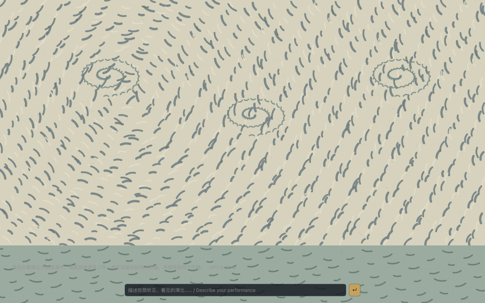

# Voice Canvas / 一句话声画演出

[Open the page](https://jojtown.github.io/voice-canvas/). The page has one prompt and no feature menus. **Model-directed performance requires the local backend**; GitHub Pages cannot access a Codex login on your computer.

```sh
python3 run.py
```

Open `http://127.0.0.1:8765` and describe a performance: **“蓝色水墨，温柔的钢琴，旋律逐渐上升”**. Submit to authorize browser audio. Type **“停止”** to stop the music and model continuation. Browser synthesis is the default. To use an instrument, ask for **MIDI** or **数码钢琴**; with several outputs, include **设备: the device name**. MIDI mode mutes browser synthesis, and incoming instrument MIDI drives the visuals without echoing back.

一个模型同时谱写音符与视觉计划，包含节奏、音高、时值、力度、风格、形态、颜色和强度。新计划在乐句边界一起切换；模型来不及时重复上一段。模型负责艺术决策，本地音频时钟与渲染器负责实时执行。没有预设选择、功能菜单或 Advanced 入口。



The existing GPT-6 Astra Codex CLI backend returns a bounded JSON score: an original piano phrase plus a coordinated visual plan. One request controls both; separate music/image model calls are not used. The browser executes note data and procedural visual parameters, rather than asking a language model to generate every frame or audio sample. Model text is never executed as code. The accepted plan retains a seed and exact notes for reproducibility; a fresh model call need not return the same plan.

A real local GPT-6 request produced a 34-note, 24-beat phrase and ink visual plan in **16.4 seconds**. This is a measured example, not a latency guarantee. New phrases are prepared asynchronously. On failure the last phrase continues and the page reports the failure; without a backend it shows a connection note and does not simulate a model response.

Install and log into Codex separately. Python 3.9+ and current Chrome are recommended; Web MIDI requires HTTPS or localhost. Hardware output is opt-in; physical instrument latency has not been measured. Browser piano tones are synthesized, not sampled recordings. Model note durations shape their decay; MIDI receives explicit note-off events.

The underlying repertoire, renderer presets, GPU gallery and optional Blender implementation remain in the project, without separate UI entry points. [Repertoire sources and licences](docs/REPERTOIRE.md), [research credits](docs/RESEARCH.md). Visual inspiration: Tim Moyers, Van Gogh, Chinese ink wash and Monet; original code-generated assets. Code MIT; data retain their documented licences.
