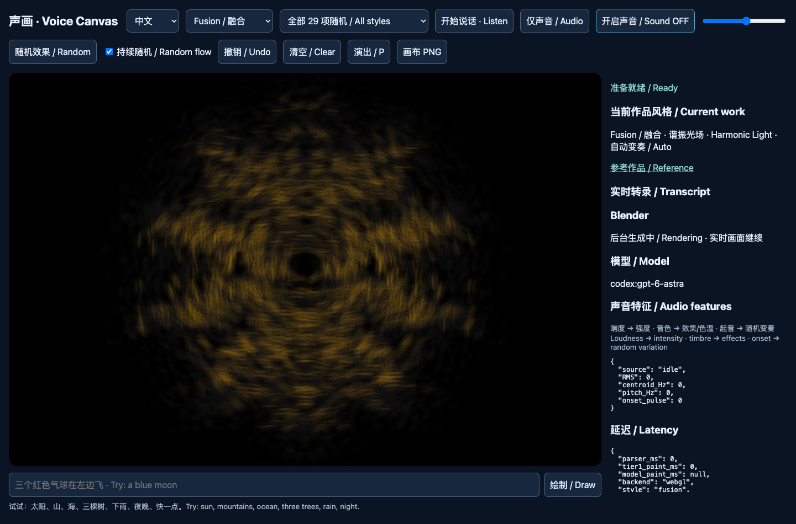
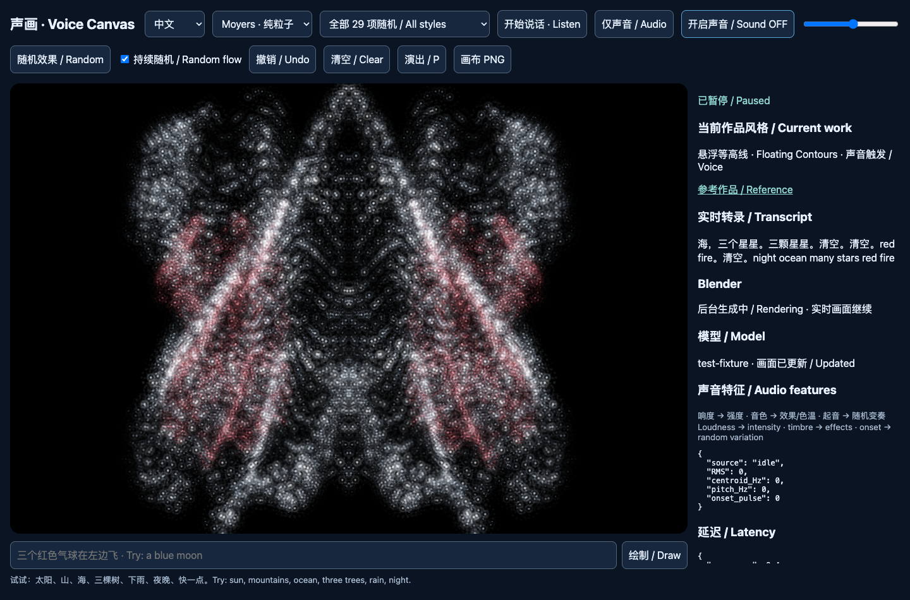
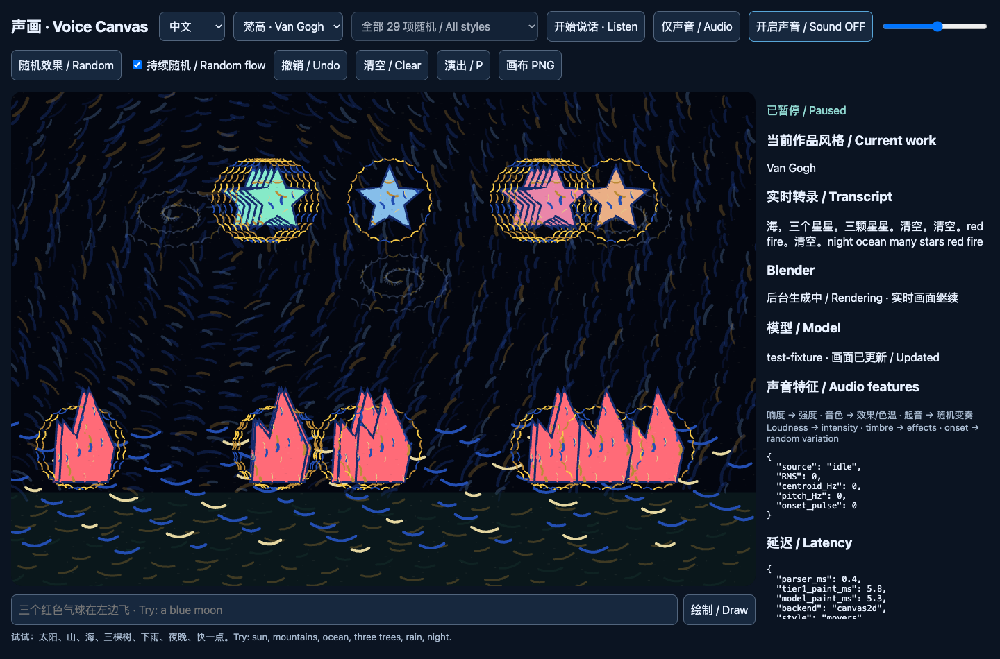
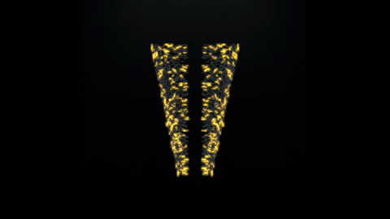
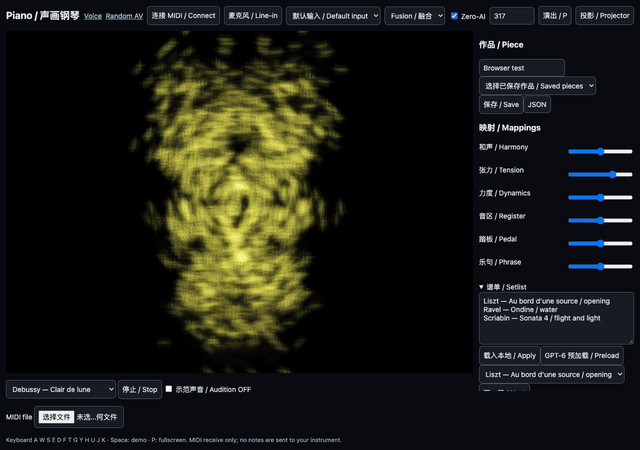

# Voice Canvas / 声画

Live speech becomes an evolving picture. Chinese-first speech semantics choose the forms; loudness, timbre, pitch and onsets shape their motion. Original procedural visuals and synthesized sound, with no copied artwork or recordings.

实时语音驱动生成画面：中文优先，语义决定形态，声音特征决定运动。画面始终实时响应，慢速模型和离线渲染不会阻塞它。全部画面与声音由代码生成，没有复制艺术家素材。

[Open Voice Canvas / 在线体验](https://jogjohgoeg.github.io/voice-canvas/) · [Random AV / 随机音画](https://jogjohgoeg.github.io/voice-canvas/av_random.html)

| Fusion / 融合 | Moyers | Van Gogh / 梵高 |
|---|---|---|
|  |  |  |



## Run / 运行

Python 3.9+; no Python packages or JS dependencies required:

```sh
python3 run.py
```

Open `http://127.0.0.1:8765`. Click **Listen / 开始说话** for Chinese speech, or **Audio / 仅声音** for sound features alone. Try “蓝色海洋、很多星星、慢一点”. Text input always works. Switch English in the language selector. **Sound starts OFF**; click Sound to hear synthesis. Echo cancellation, noise suppression and analyser ducking limit feedback.

打开上述网址，点击开始说话并允许麦克风；也可直接输入文字。声音默认关闭，需要手动开启。现代 Chrome 推荐；浏览器语音识别可能需要联网，语言和设备支持因浏览器而异。没有语音识别时，文字、麦克风特征和生成画面仍可用。

For a static server: `python3 -m http.server 8765 --directory web`. Tier 1 needs no backend. The **Backend offline / 后端离线** note is expected on Pages. Microphone access requires HTTPS or localhost. Speech recognition may use the browser's remote recognition service; it is not guaranteed offline. Random AV's synthesis and visuals work offline by opening `web/av_random.html` directly.

## Presets and controls / 风格与操作

- **Fusion / 融合** (default): symmetrical organic forms, curved impasto brush sprites, feathered grey ink and one glowing yellow or cobalt accent. Quiet leaves space; onsets spatter a complementary accent.
- **Moyers**: glowing particles on black, mirrored membranes and organic families. 29 original work studies vary geometry, palette and sound.
- **Van Gogh / 梵高**: directional thick strokes, blue-yellow swirls, halos and visible objects.
- **Ink / 水墨**: monochrome directional strokes and wash.
- **P**: fullscreen performance mode, hiding panels. Buttons provide random variation, undo, clear and PNG export. Mobile browsers can hide panels even when fullscreen is unavailable.

实时页支持持续随机变奏：音量改变笔触与速度，音色改变色温，起音触发新变奏。目标 60 fps；GPU 超过 20 ms 时自动减少粒子数量，实际速度取决于设备。

## Random AV / 独立随机音画

Open the single file `web/av_random.html`. No server, microphone or model is needed. A 32-bit unsigned decimal seed in the URL hash (for example `#317`) creates the same initial patch. Other seed text is hashed. Audio and visuals share the audio clock after the first click; scheduled grain bursts fire matching visual pulses. The synth analyser modulates particles, and reform events trigger a filter gesture. The optional microphone is a third modulator.

**Random** creates a seed; **Vary** makes a bounded mutation; auto-evolution drifts every 8–20 seconds. **Space** pauses, **S** saves PNG, **R** records 15 seconds of WebM with audio, **P** toggles performance mode. Sound defaults off and low volume; 12 transient voices maximum, a limiter and a hard ±0.25 ceiling. Recording requires MediaRecorder/WebM support. The seed reproduces the initial patch and automatic sequence; manual actions and live microphone input change the performance. Pixel-identical output across GPUs is not promised.

单文件离线运行。种子同时生成视觉和声音参数，音频时钟同步笔触、呼吸与颗粒声。随机、变奏、暂停、截图、录屏均在浏览器中完成；录制需浏览器支持 WebM。实时麦克风和手动操作不会包含在种子回放中。

## Optional tiers / 可选层

**Tier 2:** install Codex CLI and sign in with its normal CLI workflow. Put `codex` on PATH or set `VOICE_CODEX` to its executable. The Python backend maintains a persistent `codex app-server` process using `gpt-6-astra`, with `codex exec` fallback. It streams sanitized HTML/SVG into an isolated iframe. `VOICE_MODEL_TIMEOUT` controls the deadline (default 20 seconds). Model availability and account access depend on your Codex installation. This project does not manage login credentials. Tier 1 continues when generation fails or is slow.

**Tier 3:** put Blender and FFmpeg on PATH, or set `VOICE_BLENDER` and `VOICE_FFMPEG` to their executables. Tested with Blender 5.2.1 EEVEE. A single background worker prewarms eight common families, caches 2-second muted loops in `blender_cache/`, and crossfades beneath live particles. Each job has a 30-second budget; busy or failed renders fall back to WebGL. Fusion uses curved ribbon particles and volumetric ink fog. Render latency is recorded in each cache manifest. Optional sample loops are original generated examples.

第二层调用本机 Codex CLI，第三层调用 Blender/FFmpeg。两者均可不安装；不会影响第一层。模型延迟与第一层绘制延迟分别显示，后台标签页不计入可见绘制延迟。

## Phone / LAN / 手机与局域网

Pages already uses HTTPS. For your local backend, use a certificate trusted by your phone (a self-signed certificate must first be installed/trusted; simply dismissing a warning is insufficient on some browsers):

```sh
python3 run.py --host 0.0.0.0 --port 8765 --tls cert.pem,key.pem --allow-host 192.168.1.20
```

Replace the example IP with your computer's LAN address. Open `https://192.168.1.20:8765` on the phone. The explicit host allowlist and same-origin checks remain active; native TLS preserves incremental model streaming. Use only on a trusted LAN; this optional local server has no user accounts. Certificates stay outside version control.

手机可直接使用 Pages。访问本机后端需同一局域网、正确 IP 和受手机信任的 HTTPS 证书。上面的启动命令直接支持 TLS，不经过会缓冲生成结果的代理。

## Build and check / 构建与验证

```sh
python3 build/build.py
node build/test_parser.mjs
node build/test_audio.mjs
node build/test_seed.mjs
node build/test_music.mjs
python3 build/test_backend.py
python3 build/test_blender.py
```

`web/` contains editable modules; `server/` the optional backend; `build/` the tiny module bundler; `docs/` the generated Pages site and original screenshots. Rebuild after changing modules. Pages publishes `main:/docs`. `web/av_random.html` and both Pages entries have all JavaScript/CSS inline. No package manager is needed. With an isolated Chrome debug session on port 9347, `node build/test_browser.mjs` checks the actual static pages, sound activation, pause and seed restoration. `node build/test_piano_browser.mjs` adds MIDI interface events, real synthetic audio analysis, sustain, projector, presets and Zero-AI network isolation. Set `VOICE_CDP` to use a different local debug endpoint.

## Credits / 致谢

Inspired by [Tim Moyers' audiovisual and live-performance work](https://timmoyers.com/audiovisual--live-performance.html), Vincent van Gogh's paintings, and Chinese ink wash. These are original algorithmic interpretations, with no copied assets, audio samples, endorsement or affiliation. Additional visual research and links are listed in [the style catalog](docs/STYLE_CATALOG.md). All sound is synthesized locally. MIT licensed.

灵感来自 Tim Moyers 的视听现场作品、梵高和中国水墨；全部由原创代码重新表达，不复制作品素材，不代表与艺术家有关联。


## For pianists / 钢琴演奏者

[Open Piano Mode](https://jogjohgoeg.github.io/voice-canvas/piano.html). **Zero-AI is ON by default**. Connect a USB MIDI piano and click Connect MIDI, or choose microphone/line-in for an acoustic instrument. The app receives notes, velocity and CC64 sustain; it never sends commands to the piano. Standard MIDI exposed by a Disklavier/Spirio interface works like another input; proprietary transport integration is not included.

The six sliders control harmony/palette, tension/symmetry, dynamics/marks, register/placement, pedal/wash and phrase/breathing. Save these with a seed as a named piece preset in this browser, or export JSON. Key, chord, cadence, acoustic polyphony and acoustic sustain are estimates. MIDI sustain is direct controller data. Details and performance inspirations are in [RESEARCH.md](docs/RESEARCH.md).

No piano required: play either bundled **30-second Debussy excerpt**, upload a type 0/1 PPQ `.mid` file, or use computer keys **A W S E D F T G Y H U J K**. The simple audition synth defaults OFF; enable Audition to hear a demonstration. Space starts/stops the demo. **P** hides panels/fullscreens; Projector opens an independent render window that can be moved to a second display and clicked for fullscreen.

Uncheck Zero-AI to enable optional tiers, enter one piece/section per setlist line, and click GPT-6 Preload **before** the recital. Prepared briefs provide a form family and palette; Next changes section immediately. Without a backend the built-in Liszt water, Ravel Ondine and Scriabin flight/light interpretations keep working. Zero-AI cancels pending scene requests, removes generated layers and uses local section plans; other pages' background jobs are unaffected.

钢琴模式默认 Zero-AI，使用 MIDI、种子和本地规则。六组映射可保存为作品预设，谱单可在演出前异步预加载，演出时切段不等模型。无钢琴时可播放两个德彪西公有领域片段、上传 MIDI，或用电脑键盘试奏。示范声音默认关闭。投影窗口与主窗口共享同一组演奏特征。

Measured in Chrome with injected MIDI events: **7.9–22.1 ms event-to-render**, approximately 60 fps. This excludes physical device/display latency; hardware piano tests remain to be done. Zero-AI reproduces a fixed-step feature/parameter trajectory from the same MIDI, seed, mapping settings and section sequence; GPU/viewport differences and live audio may change pixels. Audio analysis has an 8192-sample window and does not share the MIDI latency claim. Standard MIDI type 2 and SMPTE timing are explicitly rejected.



### Monet and cinematic sound / 印象派与电影氛围

Choose **Monet / 印象派** for original procedural pastel clouds, reflected light and onset-driven ripples, or enable **Fusion + Monet** to combine ink forms with impressionist light. Choose **Cinematic / 电影氛围**, then explicitly turn sound on: seeded 50–70 BPM modal/minor cello-like synthesis and piano-like partials share the visual clock. Random AV records the composed picture and score together as a 15-second WebM. Sound remains off until clicked.

选择 Monet 呈现淡彩云层、水光与起音涟漪；Fusion + Monet 将水墨结构与印象派光线融合。电影氛围使用代码合成弓弦和钢琴音色，默认关闭，点击开启；随机声画页支持同步录制。可选 Blender 后台生成原生体积云与光束，忙碌时实时画布继续。
