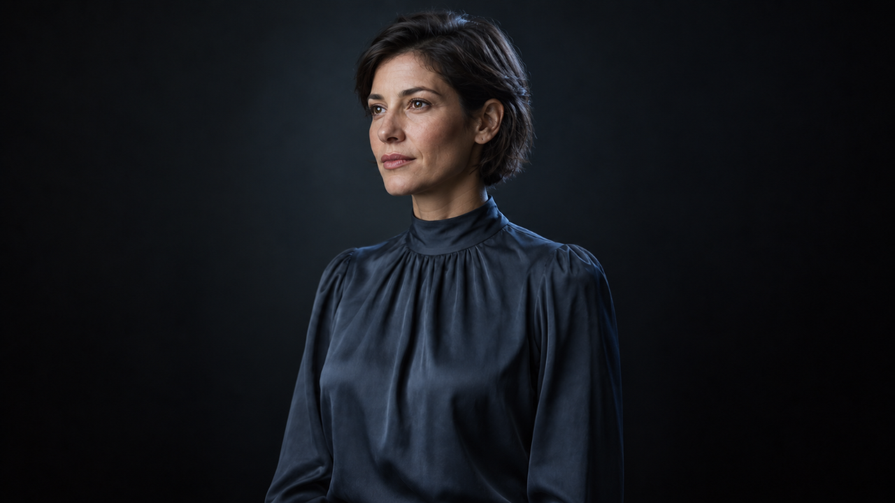

# Voice Canvas / 实时声画

**TouchDesigner 原生工程：麦克风或录音驱动实时画面。**

打开 [`touchdesigner/VoiceCanvas.toe`](touchdesigner/VoiceCanvas.toe)，在 `/project1` 的 **Audio Visual** 参数页选择 **Microphone / 麦克风** 或 **Recording / 录音**。F1 进入演出，Esc 返回编辑。默认使用麦克风；也可选择自己的录音或附带测试信号。

当前为虚构成年人物的声控衣料与呼吸效果：生成底图，加本地 GPU 二维形变，脸部保持稳定。不是三维人体或真实布料模拟。Esc 退出全屏，F1 返回演出。无需服务或在线模型；麦克风监听关闭。

**Open `touchdesigner/VoiceCanvas.toe` in TouchDesigner 2025.33230 or later.** Choose microphone or recording in `/project1` → Audio Visual. One shared audio-analysis path drives a native GPU shader. F1 enters performance; Esc returns. No server or AI service required.

[操作、节点与重建说明 / Native guide](touchdesigner/README.md)

The previous browser piano/AI/world show is preserved: [browser documentation](BROWSER.md). It is a separate legacy implementation, not required by the native project.

Original generated fictional portrait, procedural graphics and test audio; visual inspiration from audiovisual performance, Van Gogh brush marks and Chinese ink wash. No copied audiovisual assets. Project code: MIT; TouchDesigner is separately licensed by Derivative.
